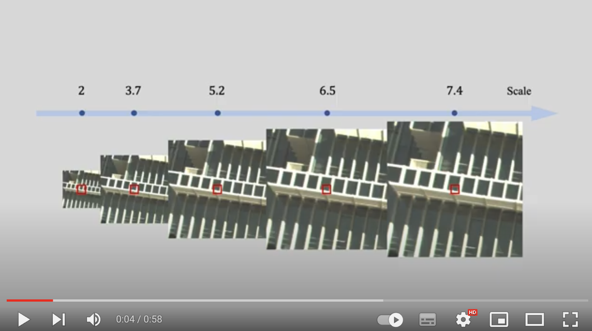

to be changed: test
<!-- <a href="https://www.youtube.com/watch?v=ty531p2Me7Q">
  
</a> -->
to be changed: test
<!-- [video](https://www.youtube.com/watch?v=ty531p2Me7Qng) -->
[](https://www.youtube.com/watch?v=ty531p2Me7Qng)

# Abstract


# Publication

```
to be changed: test
@article{fmapHua23,
  title={FMapping: Factorized Efficient Neural Field Mapping for Real-Time Dense RGB SLAM},
  author={Tongyan Hua, Haotian Bai, Zidong Cao, Lin Wang},
  year={2023}
}
```
